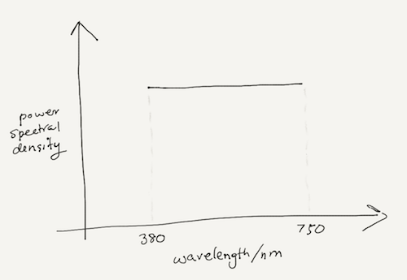
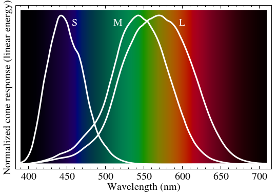
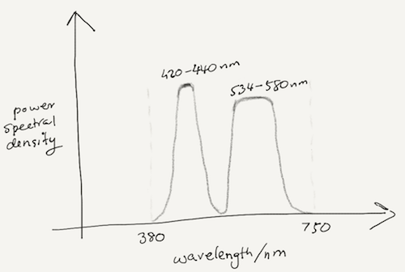

Most of us enjoy the world around us in vivid colors, and yet very few of us really pause to think about how colors really work. There are many great articles on color perception for those who are inclined to learn, but most of us don't even know what we don't know! So let's ask ourselves a simple question:

> If you have two white pieces of paper that look exactly the same in sunlight (or white light), is it possible that they look dissimilar in some other light?

To answer this question, we need to understand how color works...

## What is color?

We know that light is an electromagnetic wave, and a wave has some frequency and wavelength associated with it. We often see a chart (like the one below) mapping the wavelength of light to color:

 Figure 1: Visible spectrum of light (courtesy: Wikipedia article on visible spectrum)

The letters refer to colors (Violet, Blue, Green, Yellow, Orange, Red) and the numbers refer to the wavelengths in nm. So color essentially refers to the wavelength of light, right? Not quite, but close enough for our discussion for now. We'll come back and revisit this a little later!

## What exactly is white?

But hang on, there's no "white" in the chart above! We know from our school days that white is formed by mixing all these colors together. So we get white light when we mix equal amount of light with all wavelengths from 380 nm to 750 nm -- the entire visible spectrum of light. So if we were to sketch the spectrum of white light, we would get something like this:

 Figure 2: Spectrum of white light

Sunlight has a spectrum close to this in the visible band, although not quite as flat. But for the purposes of our discussion here, let's assume that the sunlight is well approximated by the spectrum in Figure 2.

Okay, so that is white light, but what about white paper? That's simple:
> If we shine white light on a piece of paper, and it reflects back white light, then the paper is white.

So the spectrum of visible light reflected by the white paper is exactly the same as the spectrum of light incident on it.

## How do we see white?

For us to "see" white light, do our eyes measure the entire spectrum from 380 nm to 750 nm? Not really! To see color, our eyes use three types of "cone" cells that respond differently to different wavelengths of light. The S-cones respond most strongly to blue light, the M-cones to green light, and the L-cones to red light. The normalized response spectra are shown below:

 Figure 3: Response of cones in the human eye (courtesy: Wikipedia article on color vision)

So we see white when the S-, M- and L-cones respond equally strongly to the incident light. For white light reflected off a white paper, this will certainly be true. And so we'll see the paper as "white".

> But do we really need a white paper as defined above to see the paper as white?

Consider a piece of paper that only reflects light in the 420-440 nm and 534-580 nm bands, and absorbs the light otherwise. If 420-440 nm band excites the S-cones while the 534-580 nm band excites the M- and L-cones. If the reflectivity in these bands is such that for white light incident on the paper, the reflected light excites the S-, M- and L-cones equally, then we will see the paper as "white", although the actual spectrum of the reflected light might look something like this:

 Figure 4: Spectrum of light reflected from the paper

Mathematically speaking, we would have to choose reflectivity $$\rho(\cdot)$$ of the paper (as shown in Figure 4), such that:

$$\int_{-\infty}^{\infty}\rho(f)R_S(f)df = \int_{-\infty}^{\infty}\rho(f)R_M(f)df = \int_{-\infty}^{\infty}\rho(f)R_L(f)df$$

where $$R_S(\cdot)$$ is the response of the S-cone, $$R_M(\cdot)$$ of the M-cone, and $$R_L(\cdot)$$ of the L-cone, as shown in Figure 3.

So the spectrum of the light reflected from this paper is quite different from than the spectrum of light in Figure 1, and yet we will see this paper as "white"!

## Are all whites the same?

Clearly the answer to this question now seems to be "no". The "white" paper reflecting the spectrum in Figure 2 (let's call it paper A), and the "white" paper reflecting the spectrum in Figure 4 (paper B) are different, yet our eyes perceive them as the same in white light (or sunlight).

Would we be able to differentiate between the two papers in a different light? Surely! Let's shine a monochromatic light with a wavelength of 480 nm on both pieces of paper. Paper A would reflect back the 480 nm light, and the paper will look bluish-green in that light. On the other hand, paper B will absorb the 480 nm light, and so the paper will look black!

The example above was contrived, but the principle illustrated is general:
> **Two colors that appear the same to our eyes might have very different spectrums!**

Color cameras and televisions, for example, use the fact that we have only 3 types of cones to sample and reproduce the sensation of color without reproducing light with the same spectrum as the original scene. So the spectral content of the light in a photograph is quite likely not the same as the spectral content of the light in the original scene. Yet, we see the two as the same! Change the incident light on the scene and on the photograph, and they might look completely different!!

## Wavelength or frequency?

Earlier, we assumed that color refers to the wavelength of light. It was not quite accurate, but close enough for the purposes of our discussion, but we had promised to come back to it... so let's talk about it!

Let $$\lambda$$ be the wavelength of a photon of light, and $$f$$ be it's frequency. Then $$c = f\lambda$$, where $$c$$ is the speed of light. The speed of light $$c$$ changes with medium, and so does it's wavelength $$\lambda$$.

> So does that mean the color of light changes with medium? Would light change color as it entered water from air?

Someone asked me this the other day, and I had to pause to think. There are two perspectives to answer this question:
1. Our color perception depends on the cones in our eyes. So only the wavelength of light inside our eye matters, and not whether the eye is in air or in water.
2. In physics, we define the color of a photon to be related to it's energy, which in turn is proportional to it's frequency. So it makes sense to think of the color of the photon to be defined by it's frequency rather than wavelength. However, the change in wavelength in typical mediums is so small that this technical difference isn't important to our color perception.

## References

1. [Wikipedia article on visible spectrum](https://en.wikipedia.org/wiki/Visible_spectrum#Animal_color_vision)
2. [Wikipedia article on color vision](https://en.wikipedia.org/wiki/Color_vision)
